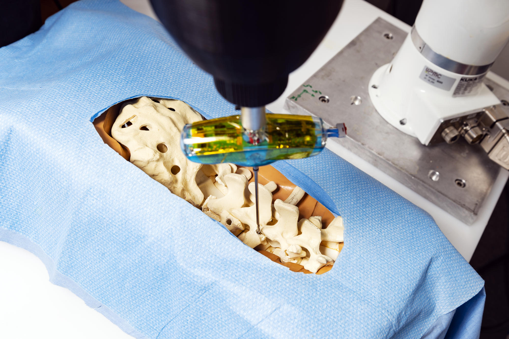

The Machine Learning for Roborics Team is structured around 4 axes accross two projects.


  <!-- Display categorized axes -->
  
  <a id="{{ category }}" href=".#{{ category }}">
    <h2 class="category">{{ category }}</h2>
  </a>
  
  
  <!-- Generate cards for each axe -->
  
  

    

    
      
    
    

  

  
  

    
      
    
  

  
  



<!-- Display axes without categories -->



  <!-- Generate cards for each axe -->



  

    

    
      
    
    

  

  
  

    
      
    
  

  


 

  

 

# Machine Learning for Robotics (MLR) team


  <!-- Display categorized members -->
  
  <a id="{{ category }}" href=".#{{ category }}">
    <h2 class="category">{{ category }}</h2>
  </a>
  
  
  <!-- Generate cards for each member -->
  
  

    

    
      
    
    

  

  
  

    
      
    
  

   
  
  



<!-- Display members without categories -->



  <!-- Generate cards for each member -->



  

    

    
      
    
    

  

  
  

    
      
    
  

  


 

# Partners

We are thanking the Agence nationale de la recherche (ANR) and the Chaire Cluster IA-SU.

<table align="center" style="width: 50%;">
  <tr>
    <td style="text-align: center;">
      
    </td>
    <td style="text-align: center;">
      
    </td>
  </tr>
</table>

 
