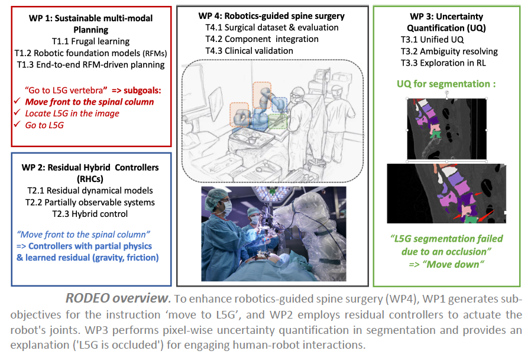

# About RODEO

The ANR RODEO project aims to transform surgical robotics by integrating the latest advancements in artificial intelligence (AI). The application framework is robot-guided surgery for the spine, based on a surgical platform available at ISIR.

In this context, a 7-degree-of-freedom (DoF) robotic arm is equipped with various sensors (position, speed, force, electrical conductivity, vibrations) and used during surgical interventions, such as the insertion of pedicle screws into the spine. This current robotic platform uses a set of already implemented control laws (e.g., position, speed, force control) to execute surgical tasks or sub-tasks, such as drilling a preliminary trajectory for pedicle screw placement. Before the operation, a 3D scan of the patient is performed, allowing the surgeon to define the medical procedure to be followed during surgery.

Although fully automatic controllers can be used for some safe sub-tasks, surgeons prefer a co-manipulation paradigm for sensitive operations, where surgical robots assist medical procedures. In this case, the robotic assistant must faithfully respond to the surgeon's instructions while ensuring the safety of the patient and medical staff and adapting to the environment.

# Context

While the current co-manipulation system is useful and meets some of the surgeons' needs, it can be significantly improved to enhance the surgical experience. The ISIR surgical platform lacks perception and registration modules, and the current procedure assumes that the patient does not move once positioned for surgery and that the spine is rigid. This can make the transfer of preoperative information complex, inaccurate, and dangerous for the patient. Additionally, current controllers do not account for certain complex physical phenomena during co-manipulation, such as robot friction, vibrations, or gravitational compensation, all of which are crucial for precise surgical interventions.

# Objectives

The RODEO project aims to develop the next generation of deep generative AI to overcome the main challenges mentioned. The goal is to design AI systems with improved robustness in terms of flexibility and reliability while remaining sustainable, as well as hybrid models capable of integrating physical knowledge of the world.

The central hypothesis of the research is that these improvements can lead to a major advancement in surgical robotics. More reliable AI systems can improve their acceptance by medical experts and patients, particularly by allowing them to evaluate their own confidence or explain their decisions in an understandable way. Sustainable hybrid models could significantly improve the level of automation in robot/surgeon co-manipulation, thereby reducing the cognitive load on surgeons and allowing them to focus entirely on medical interventions, which would improve surgical procedures and patient care.